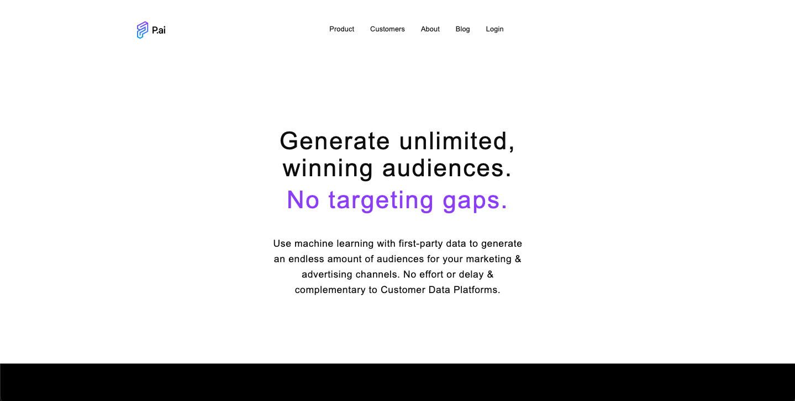

# P.ai website page

This is a website page for p.ai service. This version isn't real, just to practice my React skills.

## Table of contents

- [Overview](#overview)
  - [The challenge](#the-challenge)
  - [Screenshot](#screenshot)
  - [Links](#links)
- [My process](#my-process)
  - [Built with](#built-with)
  - [What I learned](#what-i-learned)
  - [Continued development](#continued-development)
  - [Useful resources](#useful-resources)
- [Author](#author)

## Overview

### The challenge

Users should be able to:

- View the optimal layout for the site depending on their device's screen size
- See hover states for all interactive elements on the page

### Screenshot




### Links

- Live Site URL: https://sue-p-ai.netlify.app/

## My process

### Built with

- Semantic HTML5 markup
- CSS custom properties
- Flexbox
- Mobile-first workflow
- [React](https://reactjs.org/) - JS library

### What I learned

- Imporing Font awesome icons to React app.
- prevState configurations

```js
 onClick={(icon) => setIsMenuOpen((prevState) => !prevState)}
```

- Mobile-first workflow
- Nice underline for links

```css
a::after {
  display: flex;
  cursor: pointer;
  content: "";
  position: relative;
  left: 50%;
  transform: translateX(-50%);
  width: 0;
  height: 2px;
  background-color: black;
  transition: width 0.5s ease;
}

a:hover::after,
a:active::after {
  width: 100%;
}
```

- Quotes before text

```css
p::before {
  position: absolute;
  left: -13%;
  top: 25%;
  content: "\201c";
  font-size: 4em;
  color: #0d0d0d;
  margin-right: 0.1em;
  font-family: "Libre Franklin", sans-serif;
}
```

- How to make different color the last word of the text

```js
<p data-last-word={reviewText.split(" ").pop()}>
  {reviewText.replace(/\s+\S*$/, "")}
</p>
```

where

```js
replace(/\s+\S*$/, "");
```

is to delete that one last word because we add it with

```js
reviewText.split(" ").pop();
```

and change the color with CSS

```css
p::after {
  content: "";
  display: inline;
  width: 100%;
  height: 0;
}

p::after {
  color: #0d0d0d;
  content: " " attr(data-last-word);
}
```

### Continued development

- Fix navbar to avoid page reloading to see correct style of the navigation menu
- Add Tailwind

### Useful resources

- [tailwind cheat sheet](https://nerdcave.com/tailwind-cheat-sheet) - to orient on the Breakpoints (screen sizes) that wrap utility classes.
- [frontendmentor challenge](https://www.frontendmentor.io/challenges/loopstudios-landing-page-N88J5Onjw) - that helped me a lot to find a solution to the nice underline for links.
- [react documentation](https://react.dev/)
- [CSS quotes](https://webref.ru/css/quotes)
- ChatGPT, of course.

## Author

- X - [@suereact](https://www.x.com/suereact)
